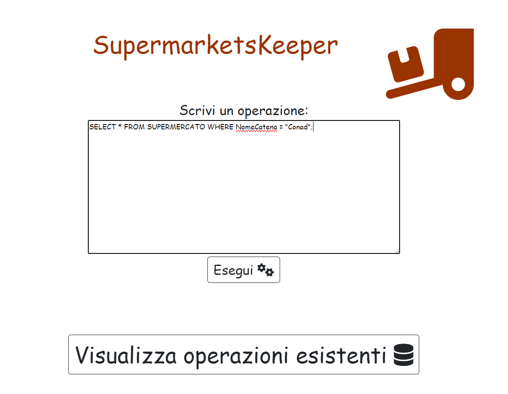
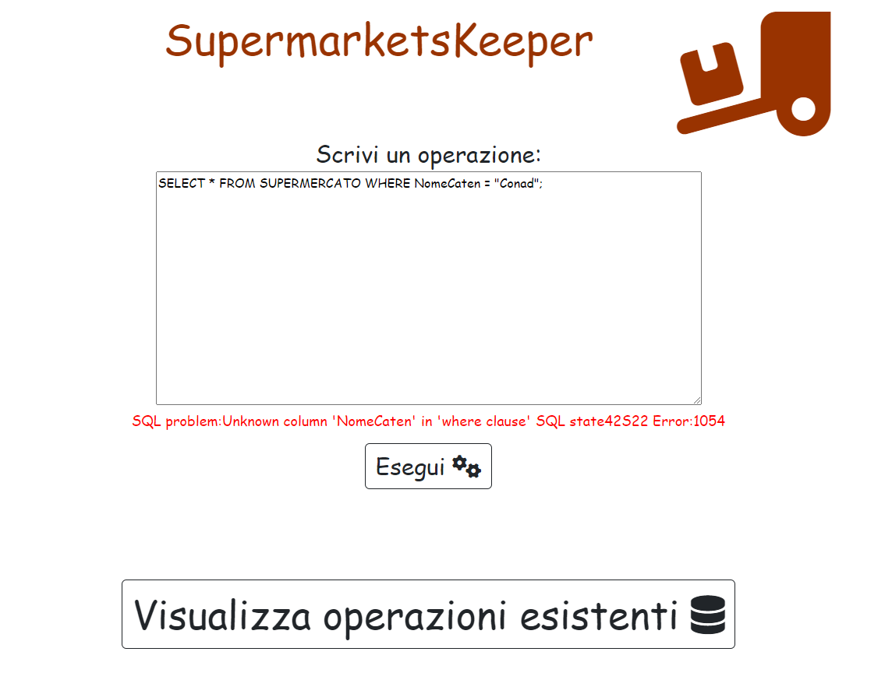
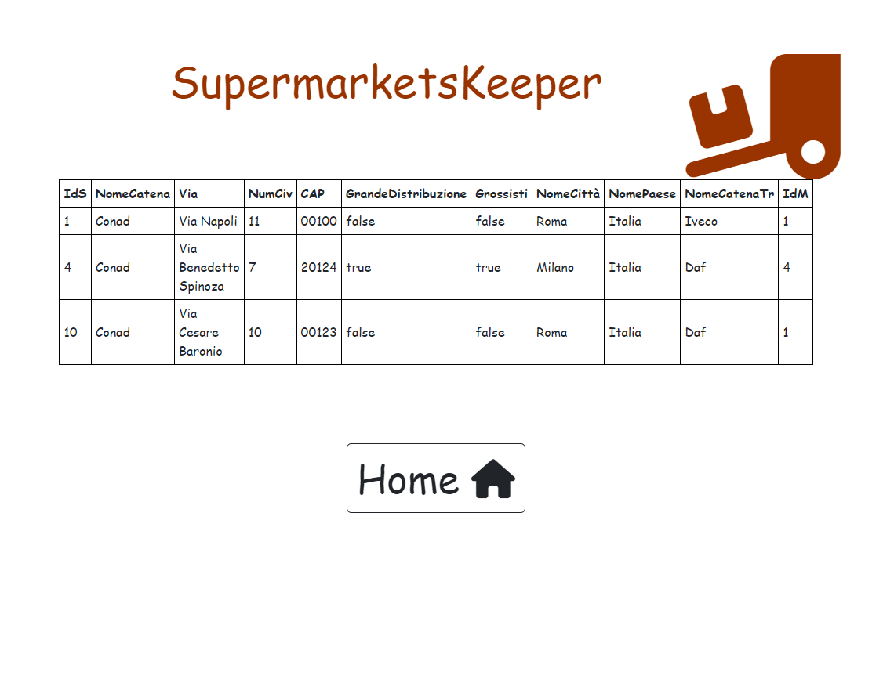

# SupermarketsKeeper
This is a web-app project made to pass the exam of Databases Module 2 of Computer Science course in La Sapienza University of Rome.

This Web-App was made to find information about different fictitious supermarket companies, like the products they sell, transport information, etc... It gives the user the opportunity to write mysql code directly on the browser.
# Main page:

It shows mysql errors:

It shows tables directly on the browser:

Several operations can be choosen directly to facilitate tasks:

